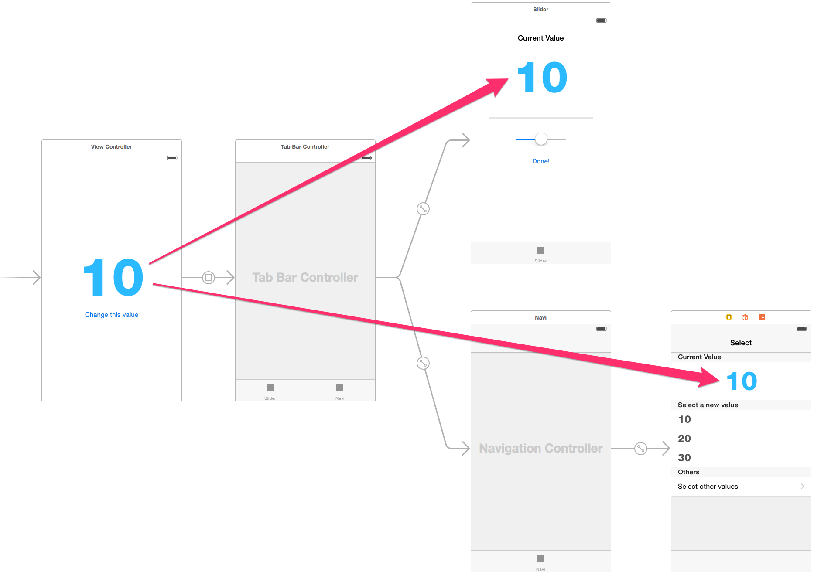

SegueContext
==================

[](https://img.shields.io/cocoapods/v/SegueContext.svg)

You can pass the context to destination view controller easily.



This is new version of [TKRSegueOptions](https://github.com/tokorom/TKRSegueOptions) for Swift!

## Do you have no complaints on the view controller transition now?

- **Tight coupling!**
- **That's a bother...**

### This is a bother code...

```swift
self.performSegueWithIdentifier("Next", sender: nil)

// and

override func prepareForSegue(segue: UIStoryboardSegue, sender sender: AnyObject?) {
    switch segue.identifier {
    case "Next":
        if let nextViewController = segue.destinationViewController as? NextViewController {
            nextViewController.value = 10
            nextViewController.delegate = self
        }
    case "OtherWithNavi":
        if let navigationController = segue.destinationViewController as? UINavigationController {
            if let nextViewController = navigationController.viewControllers.first as? NextViewController {
              nextViewController.value = 20
            }
        }
    default:
        break
    }
}

// and

extension MyViewController: NextViewControllerDelegate {
    override func itemDidSelect(item: Item) {
        // get an item!
    }
}
```

**SegueContext will solve these problems!**

### This is a new simple code with SegueContext! yeah!

```swift
self.performSegueWithIdentifier("Next", context: 10) { (item: Item) -> Void in
    // get an item!
}
```

## Simple Usage

### When you want to send a context to the destination ViewController

- Source View Controller

```swift
self.performSegueWithIdentifier("Next", context: 10)
```

-  Destination View Controller

```swift
if let value: Int = self.contextValue() {
    self.value = value
}
```

### When you need callback from destination ViewController

- Source View Controller

```swift
self.performSegueWithIdentifier("Next", context: 10) { (item: Item) -> Void in
    // get an item!
}
```

-  Destination View Controller

```swift
if let callback: (Item) -> Void = self.callback() {
    callback(selectedItem)
}
```

### When you need Container View Controller

- Sample 1: manually

```swift
if let viewController = self.childViewControllers.first as? XXX {
    viewController.sendContext(10)
}
```

- Sample 2: use prepareForSegue

```swift
override func prepareForSegue(segue: UIStoryboardSegue, sender: AnyObject?) {
    self.contextSenderForSegue(segue) { segueIdentifier, viewController, sendContext in
        switch segueIdentifier {
        case "Embedded1", "Embedded2":
            sendContext(10)
        default:
            break
        }
    }
}
```

## Other Usages

### performSegue

```swift
// normal
self.performSegueWithIdentifier("Next", context: 10)

// with callback
self.performSegueWithIdentifier("Next", context: 10) { (item: YourItem) -> Void in
    // get a your item!
}
```

### presentViewController

```swift
self.presentViewControllerWithStoryboardName("xxx", animated: true, context: 10)
self.presentViewControllerWithStoryboardName("xxx", identifier: "xxx", animated: true, context: 10)
self.presentViewControllerWithIdentifier("xxx", animated: true, context: 10)
self.presentViewControllerWithStoryboard(storyboard, animated: true, context: 10)

self.presentViewControllerWithStoryboardName("xxx", context: 10) { (item: YourItem) -> Void in
    // get a your item!
}
```

### pushViewController

```swift
self.pushViewControllerWithStoryboardName("xxx", animated: true, context: 10)
self.pushViewControllerWithStoryboardName("xxx", identifier: "xxx", animated: true, context: 10)
self.pushViewControllerWithIdentifier("xxx", animated: true, context: 10)
self.pushViewControllerWithStoryboard(storyboard, animated: true, context: 10)

// with callback
self.pushViewControllerWithStoryboardName("xxx", context: 10) { (item: YourItem) -> Void in
    // get a your item!
}
```

### Manually send the context

```swift
viewController.sendContext(10)
```

```swift
let vc = UIViewController.viewControllerFromStoryboardName("xxx", context: 10) as? MyViewController
let vc = UIViewController.viewControllerFromStoryboardName("xxx", identifier: "xxx", context: 10) as? MyViewController
let vc = UIViewController.viewControllerFromStoryboard(storyboard, context: 10) as? MyViewController
```

## Additional good news!

- SegueContext sends automatically the context to rootViewController of **UINavigationController**
- SegueContext sends automatically the context to viewControllers of **UITabBarController**


## Installation

### CocoaPods

[CocoaPods](http://cocoapods.org) is a dependency manager for Cocoa projects.

CocoaPods 0.36 adds supports for Swift and embedded frameworks. You can install it with the following command:

```bash
$ gem install cocoapods
```

To integrate SegueContext into your Xcode project using CocoaPods, specify it in your `Podfile`:

```ruby
source 'https://github.com/CocoaPods/Specs.git'
platform :ios, '8.0'
use_frameworks!

pod 'SegueContext'
```

Then, run the following command:

```bash
$ pod install
```
